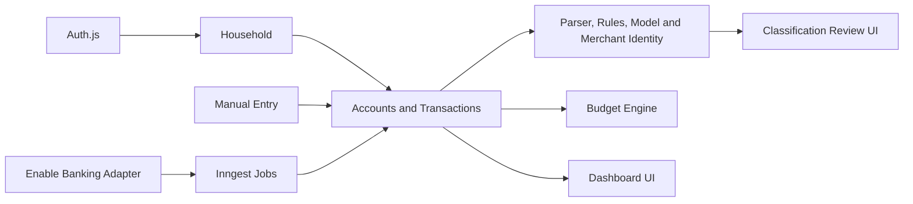
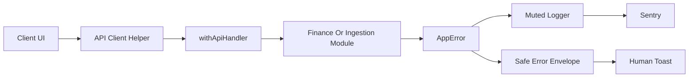

# Architecture

Get a Bud separates the finance ledger from ingestion providers.

## Core Boundaries

- `src/db/schema.ts` defines the durable data model.
- `src/lib/finance` contains budget, category and household helpers.
- `src/lib/classification` contains parser, model, transfer-linking,
  recurring-detection and UI-state helpers for the classification system.
- `src/lib/ingestion` defines provider-independent normalized account and
  transaction shapes.
- `src/lib/ingestion/enable-banking` contains all Enable Banking specifics.
- `src/inngest` owns scheduled and asynchronous workflows.
- `src/assets/fonts/mona-sans` stores the checked-in Mona Sans webfont assets.

## MVP Data Flow

Manual API routes and Enable Banking sync both create `financial_accounts` and
`transactions`. Account display metadata remains user editable even when an
account is provider-linked, while provider IDs, raw payloads and bank-owned
transaction facts stay tied to the ingestion layer. Categorization rules can be
applied after import, and budget views read from the same transaction table.
Manual account opening balances are represented as ledger transactions so
displayed balances remain explainable by transaction history.

Authenticated app pages read household-scoped ledger, budget, bill, asset and
liability data. Search is scoped to the active household and backed by a
`pg_trgm` GIN index on `search_text` for efficient `ILIKE` matching. The public
`/demo` route uses demo data for reliable first-run visual testing.

Enable Banking now follows the full authorization lifecycle: encrypted user
credentials, `POST /auth`, server-stored hashed state, `/api/callback`,
`POST /sessions`, server-side session storage and Inngest sync.

Sync resolves account IDs from the session, fetches account details and balances,
then fetches transactions with Enable Banking pagination semantics. Initial
imports use `strategy=longest`; later syncs use a recent default window. The
sync loop follows `continuation_key` until completion and records progress in
`sync_runs.metadata` so the UI can recover running or rate-limited state after a
refresh. Continuation keys are scoped to the sync run and exact transaction
request parameters so stale cursors are not replayed with a new date window or
fetch strategy. A connection only moves to incremental date-window sync after a
completed initial transaction import records that baseline in connection
metadata. Long imports are checkpointed after a bounded page/time budget and
continued by a follow-up Inngest event using the same `sync_runs` row, avoiding
serverless function timeouts while preserving progress.

Displayed account balances are ledger-derived. If the available transaction
history does not add up to the provider-reported balance, the sync maintains an
opening balance adjustment transaction and records reconciliation metadata on the
account. Manual transactions on synced accounts are flagged because they may
affect the ledger/provider reconciliation.

Budget read models live in `src/lib/finance` and calculate current-period spend
from `transactions` and `budget_lines`. The dashboard and budget page consume the
same helper so budget health is not duplicated in page components.

## Classification Pipeline

Transaction classification is asynchronous and household scoped. New manual
transactions and Enable Banking imports can queue Inngest jobs that enrich rows
without changing bank-owned facts such as amount, currency, account or booking
date.

The pipeline currently includes:

- parser backfill and sync-time parsing for Norwegian Enable Banking
  descriptions, including transaction type, payment channel and original
  currency metadata;
- merchant identity and alias resolution for stable merchant names and default
  merchant categories;
- field-scoped category rules and user-correction learning;
- a per-household Naive Bayes model with confidence thresholds for auto-apply
  and suggestions;
- auto-label metadata for description and merchant rewrites, with user undo;
- transfer linking and one-sided transfer budget exclusion;
- recurring bill detection that tracks cadence, amount patterns, original
  currency, delayed payments and possible cancellations.

The transaction list is the main review surface. It shows confidence state,
suggestions, approve/reject actions, auto-label undo, transfer badges and bank
facts alongside editable user enrichment. Search mirrors the classification
state indicators, while the bills page remains the recurring-bill review
surface.

Long-running classification jobs must avoid relying on a single Inngest run for
an unbounded data set. Jobs that page through historical rows should process a
bounded page or stop before the runtime/step budget is exhausted, then enqueue a
continuation event. Parser backfill marks each attempted row with
`parser_source` (`norwegian` or `none`) so retries and continuations are
idempotent.

## Inngest Environments

Inngest app sync is environment-specific. Production events must target the
production deployment and production database. Preview or branch deployments
should use a separate Inngest branch/custom environment with its own event and
signing keys; otherwise the latest synced preview deployment can receive
production events while pointing at preview data.

## Runtime Protection

`middleware.ts` protects authenticated app pages and non-public API routes.
Public exceptions are intentionally narrow: Auth.js endpoints, registration,
Inngest webhooks and the Enable Banking callback. App pages redirect to
`/sign-in`; API routes return the standard unauthenticated JSON shape.

Arcjet rate limits protect registration, credentials auth and Enable Banking
authorization starts. Production CSP removes `unsafe-eval`; local development
keeps it available for tooling that needs it.

## Cross-Cutting Error Flow

Route handlers use `withApiHandler()` to normalize thrown `AppError`s into a
stable JSON envelope with a request id. Client components parse that envelope
with `parseApiResponse()` and feed specific human-readable messages to Sonner
toasts. Unexpected failures and handled provider/job deviations go through the
muted logger, which redacts sensitive fields and reports to Sentry when
`SENTRY_DSN` is configured.

