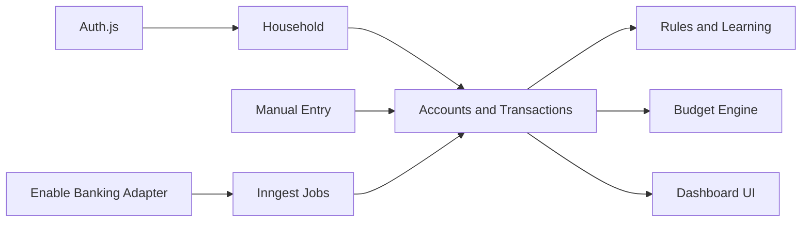
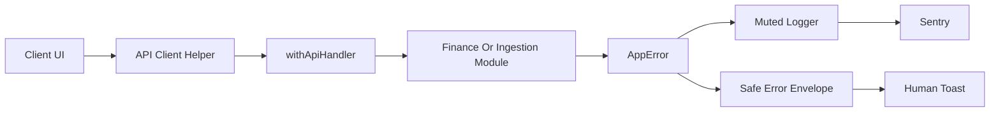

# Architecture

Get a Bud separates the finance ledger from ingestion providers.

## Core Boundaries

- `src/db/schema.ts` defines the durable data model.
- `src/lib/finance` contains budget, category and household helpers.
- `src/lib/ingestion` defines provider-independent normalized account and
  transaction shapes.
- `src/lib/ingestion/enable-banking` contains all Enable Banking specifics.
- `src/inngest` owns scheduled and asynchronous workflows.
- `src/assets/fonts/mona-sans` stores the checked-in Mona Sans webfont assets.

## MVP Data Flow

Manual API routes and Enable Banking sync both create `financial_accounts` and
`transactions`. Account display metadata remains user editable even when an
account is provider-linked, while provider IDs, raw payloads and bank-owned
transaction facts stay tied to the ingestion layer. Categorization rules can be
applied after import, and budget views read from the same transaction table.

The authenticated dashboard reads live ledger data. The public `/demo` route
uses demo data for reliable first-run visual testing.

Enable Banking now follows the full authorization lifecycle: encrypted user
credentials, `POST /auth`, server-stored hashed state, `/api/callback`,
`POST /sessions`, server-side session storage and Inngest sync.

Sync resolves account IDs from the session, fetches account details and balances,
then fetches transactions with Enable Banking pagination semantics. Initial
imports use `strategy=longest`; later syncs use a recent default window. The
sync loop follows `continuation_key` until completion and records progress in
`sync_runs.metadata` so the UI can recover running or rate-limited state after a
refresh. Continuation keys are scoped to the sync run and exact transaction
request parameters so stale cursors are not replayed with a new date window or
fetch strategy.

Displayed account balances are ledger-derived. If the available transaction
history does not add up to the provider-reported balance, the sync maintains an
opening balance adjustment transaction and records reconciliation metadata on the
account. Manual transactions on synced accounts are flagged because they may
affect the ledger/provider reconciliation.

## Cross-Cutting Error Flow

Route handlers use `withApiHandler()` to normalize thrown `AppError`s into a
stable JSON envelope with a request id. Client components parse that envelope
with `parseApiResponse()` and feed specific human-readable messages to Sonner
toasts. Unexpected failures and handled provider/job deviations go through the
muted logger, which redacts sensitive fields and reports to Sentry when
`SENTRY_DSN` is configured.

