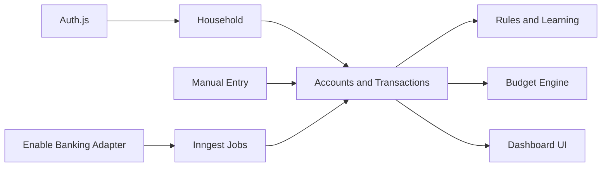
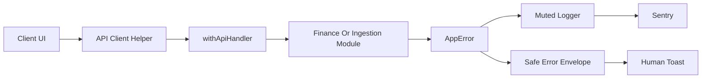

# Architecture

Get a Bud separates the finance ledger from ingestion providers.

## Core Boundaries

- `src/db/schema.ts` defines the durable data model.
- `src/lib/finance` contains budget, category and household helpers.
- `src/lib/ingestion` defines provider-independent normalized account and
  transaction shapes.
- `src/lib/ingestion/enable-banking` contains all Enable Banking specifics.
- `src/inngest` owns scheduled and asynchronous workflows.
- `src/assets/fonts/mona-sans` stores the checked-in Mona Sans webfont assets.

## MVP Data Flow

Manual API routes and Enable Banking sync both create `financial_accounts` and
`transactions`. Categorization rules can be applied after import, and budget
views read from the same transaction table.

The dashboard and public `/demo` route currently use demo data for reliable
first-run visual testing. Backend routes and database tables are in place for
live persistence once the UI forms are connected.

Enable Banking now follows the full authorization lifecycle: encrypted user
credentials, `POST /auth`, server-stored hashed state, `/api/callback`,
`POST /sessions`, server-side session storage and Inngest sync.

## Cross-Cutting Error Flow

Route handlers use `withApiHandler()` to normalize thrown `AppError`s into a
stable JSON envelope with a request id. Client components parse that envelope
with `parseApiResponse()` and feed specific human-readable messages to Sonner
toasts. Unexpected failures and handled provider/job deviations go through the
muted logger, which redacts sensitive fields and reports to Sentry when
`SENTRY_DSN` is configured.

